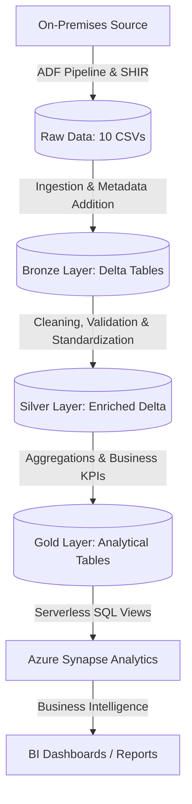
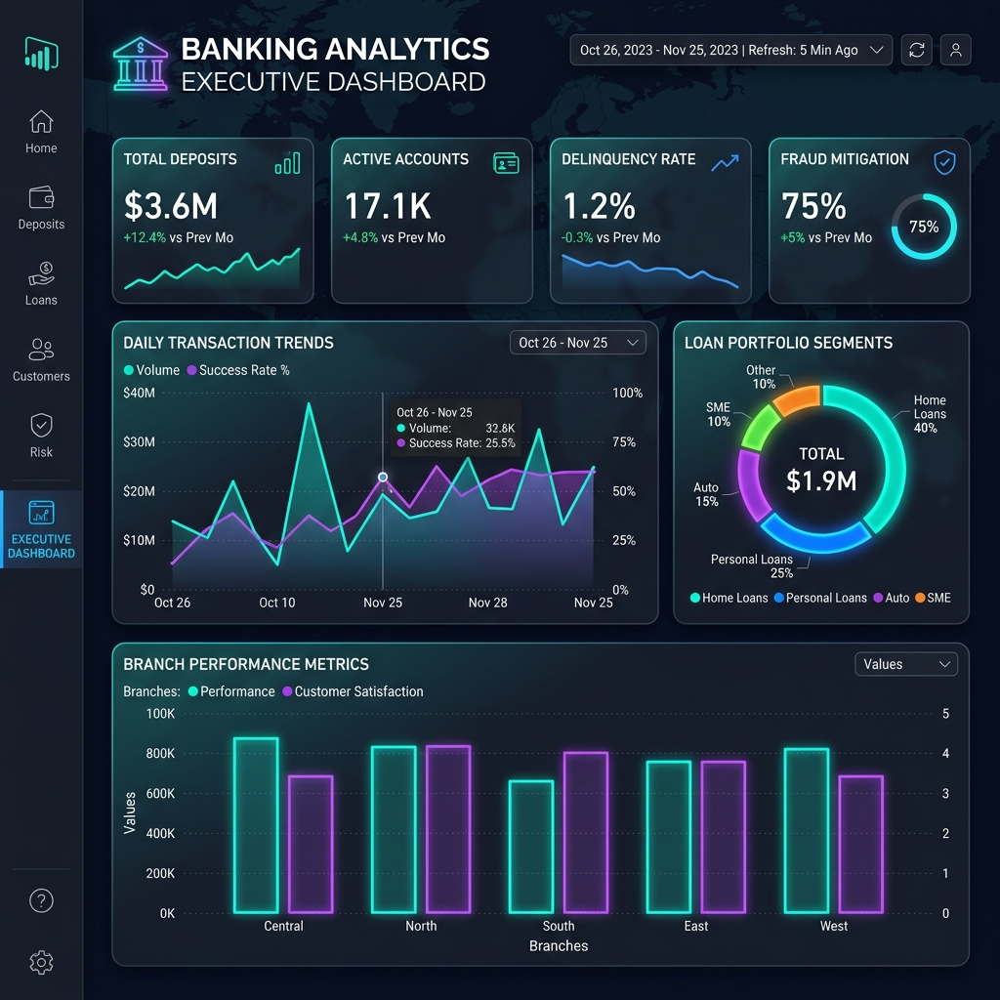

# Complete Banking Analytics Project

A comprehensive, production-grade end-to-end data engineering project built on the Azure Cloud platform. This project implements a modern Lakehouse architecture (Medallion pattern: Raw → Bronze → Silver → Gold) to ingest, process, clean, and analyze banking data for business intelligence.

## 📊 Project Overview
The project processes a comprehensive banking dataset comprising 10 relational tables:
* **customers.csv** (1,000 rows) - Customer demographic and profile details.
* **accounts.csv** (1,400 rows) - Bank account information, status, and balances.
* **transactions.csv** (10,000 rows) - Transaction histories (credits/debits, channels).
* **loans.csv** (800 rows) - Active loans, terms, interest rates, and status.
* **credit_cards.csv** (900 rows) - Card limits, usage, and outstanding balances.
* **branches.csv** (50 rows) - Bank branch location details.
* **employees.csv** (500 rows) - Staff records, salaries, and assignments.
* **fraud_transactions.csv** (600 rows) - Investigated fraud cases and loss metrics.
* **insurance_products.csv** (700 rows) - Policy details, premiums, and coverage.
* **customer_support_tickets.csv** (1,200 rows) - Customer support history and resolutions.

---

## 🛠️ Technology Stack
* **Cloud Infrastructure:** Microsoft Azure
* **Data Ingestion & Orchestration:** Azure Data Factory (ADF)
* **On-Premises Connectivity:** Self-Hosted Integration Runtime (SHIR)
* **Secrets Management / Security:** Azure Key Vault
* **Data Storage:** Azure Data Lake Storage Gen2 (ADLS Gen2)
* **Compute / Processing:** Azure Databricks (PySpark)
* **Data Lakehouse Format:** Delta Lake (ACID transactions, schema enforcement)
* **Governance & Security:** Unity Catalog (Catalog, schema, and table management)
* **Data Warehousing / Analytics:** Azure Synapse Analytics (Serverless SQL pools)

---

## 🔌 ADF Ingestion Pipeline
To securely and automatically ingest data from the on-premises database environment to the cloud, the project implements a robust **Azure Data Factory (ADF)** orchestrator:
* **Self-Hosted Integration Runtime (SHIR):** Established a secure gateway to transfer the 10 banking CSV files from the on-premises source environment into the ADLS Gen2 `raw` container without exposing the source network to the public internet.
* **Dynamic Ingestion Logic:**
  * **GetMetadata Activity:** Validates file availability and structure before starting the transfer.
  * **ForEach Loop:** Iterates through files to process them individually and concurrently.
  * **Parameterized Configurations:** Utilizes ADF `Set Variable` and parameters to handle file naming dynamically, allowing ingestion of millions of files dynamically without manual pipeline modification.
* **Scheduling & Monitoring:**
  * **Daily Schedule Trigger:** Configured to run automatically at **1:00 AM IST** for consistent batch processing.
  * **On-Failure Alerting:** Implemented conditional execution paths; if any activity fails, an **ADF Web Activity** triggers an automated email alert detailing the execution failure and the specific `Pipeline Run ID`.
* **Enterprise Security:** All connection strings, database credentials, and service keys are secured in **Azure Key Vault** and dynamically accessed via ADF Linked Services.

---

## 📐 Medallion Architecture Implementation

### 1. Ingestion & Raw Layer
* Storage of the original 10 CSV datasets in Azure Data Lake Storage Gen2 (`raw` container).
* Scripted ingestion using **Databricks PySpark** notebooks.

### 2. Bronze Layer (Raw Tables with Metadata)
* Raw tables written to the `bronze` container in **Delta** format.
* Added system metadata to track data lineage:
  * `ingestion_timestamp`
  * `source_file`
  * `ingestion_batch_id`

### 3. Silver Layer (Cleaned & Standardized)
Implemented over 50 transformation rules to clean and standardize the data:
* **Customers:** Age calculation, income bracketing, name capitalization, and email domain extraction.
* **Accounts:** Balance categorization, nominee presence checking, and account age tracking.
* **Transactions:** Temporal extraction (year, month, day, quarter, day of week), categorization, and payment method standardization.
* **Loans:** Interest rate categorization, total payable calculation, and delinquency tracking.
* **Credit Cards:** Credit utilization percentage calculations and expiration tracking.

### 4. Gold Layer (Business KPIs & Aggregations)
Constructed 10 analytical views and aggregations for reporting:
1. **Customer 360 View:** Consolidated profile of customer balances, loans, credit cards, insurance, and risk score.
2. **Branch Performance Metrics:** Deposits, loans disbursed, net transaction flow, and employee efficiency.
3. **Loan Portfolio Analysis:** Segments loan volume by type, status, and customer demographic.
4. **Fraud Analysis Dashboard:** Monthly fraud counts, total loss, and investigation confirmation rates.
5. **Daily Transaction Trends:** Volumetric and financial success rates by transaction channels.
6. **Customer Support Metrics:** SLA compliance, average resolution times, and volume by category.
7. **Monthly Financial Summary:** Aggregate credit/debit volumes and payment method splits.
8. **Employee Performance Metrics:** Active employee counts and salary brackets.
9. **Product Cross-Sell Insights:** Penetration rate of loans, cards, and insurance.
10. **Account Balance Distribution:** Deposit density segmentations by branch region.

---

## 📊 Power BI Executive Dashboard
Based on the Gold Layer business aggregations, the Power BI team can build an executive-level dashboard. Below is the conceptual design mockup showcasing the modern, glassmorphic UI with key metrics, daily transaction trends, loan distributions, and branch performance metrics:

---

## 🚀 Getting Started

### Prerequisites
* Active Azure Subscription.
* Azure Databricks Workspace (Premium tier recommended for Unity Catalog support).
* Azure Synapse Analytics Workspace.

### Deployment Walkthrough
A complete step-by-step deployment guide is available in the [Banking Project.pdf](file:///C:/Users/sanke/Videos/Project/Banking%20Project.pdf) document, detailing:
1. Azure Resource Group & Storage Container setups.
2. Databricks Cluster configuration (Spark 3.4.1 / Scala 2.12).
3. Unity Catalog storage credential and external location grants.
4. PySpark Notebook implementation for Raw → Bronze → Silver → Gold layers.
5. Synapse Serverless SQL Database creation and Serverless Views deployment.

---

## 📈 Key Project Metrics & Deliverables
* **Total processed records:** 17,150 rows.
* **Total database objects:** 30 Delta Tables (10 Bronze, 10 Silver, 10 Gold).
* **Performance improvement:** 10-100x query speed enhancement by moving from CSV to Delta Lake (partitioned).
