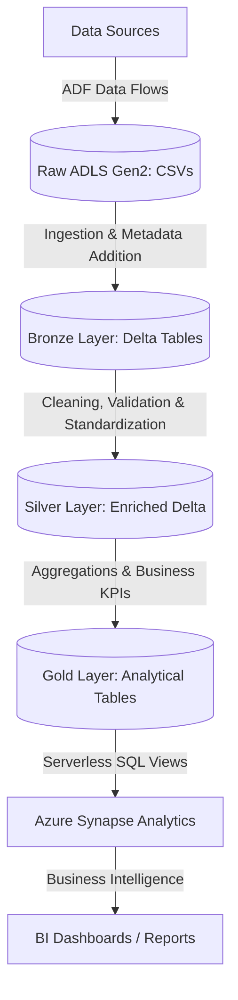
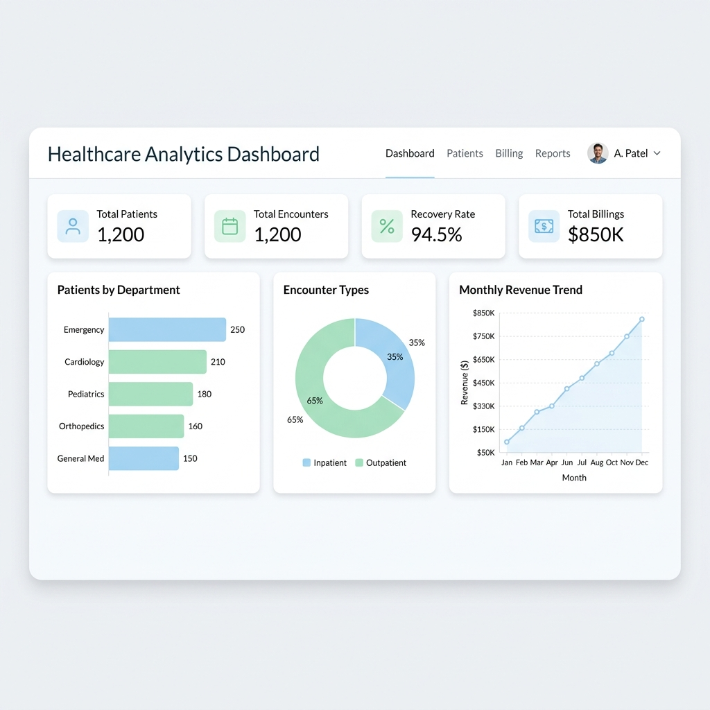

# Complete Healthcare Analytics Project

A comprehensive, production-grade end-to-end data engineering project built on the Azure Cloud platform. This project implements a modern Lakehouse architecture (Medallion pattern: Raw → Bronze → Silver → Gold) to ingest, process, clean, and analyze healthcare data for hospital administration and business intelligence.

## 📊 Project Overview
The project processes a comprehensive healthcare dataset comprising 10 relational tables:
* **patients.csv** (200 rows) - Patient profiles, demographics, dates of birth, and contact info.
* **encounters.csv** (200 rows) - Inpatient/Outpatient visit entries, dates, and departments.
* **diagnoses.csv** (200 rows) - Diagnosed conditions, codes, descriptions, and severity.
* **procedures.csv** (200 rows) - Medical procedures performed, dates, and cost details.
* **medications.csv** (200 rows) - Prescribed drugs, dosage instructions, and durations.
* **doctors.csv** (20 rows) - Clinical staff registry and specialties.
* **departments.csv** (8 rows) - Hospital department directory and layouts.
* **insurance_providers.csv** (10 rows) - Insurance providers, plans, and coverage percentages.
* **appointments.csv** (200 rows) - Scheduled appointments, status, and patient details.
* **billing.csv** (200 rows) - Hospital billing invoices, insurance payments, and patient paid flags.

---

## 🛠️ Technology Stack
* **Cloud Infrastructure:** Microsoft Azure
* **Data Ingestion & Visual Transformation:** Azure Data Factory (ADF) utilizing **Mapping Data Flows**
* **Secrets Management / Security:** Azure Key Vault
* **Data Storage:** Azure Data Lake Storage Gen2 (ADLS Gen2)
* **Compute / Processing:** Azure Databricks (PySpark)
* **Data Lakehouse Format:** Delta Lake (ACID transactions, schema enforcement)
* **Governance & Security:** Unity Catalog (Catalog, schema, and table management)
* **Data Warehousing / Analytics:** Azure Synapse Analytics (Serverless SQL pools)

---

## 🔌 ADF Mapping Data Flows
Unlike traditional pipeline scripting, this project utilizes **ADF Mapping Data Flows** to achieve visual, code-free data transformations:
* **Visual Ingest Engine:** Reads from on-premises sources using Linked Services and transforms data inside the ADF visual drag-and-drop workspace.
* **Inline Schema Validation:** Auto-resolves incoming schemas, select/rename activities, and filters out corrupted or invalid inputs.
* **Derived Columns & Aggregations:** Computes derived metrics (such as patient age, transaction splits) and joins datasets directly inside the data flow container before writing to Delta Lake sinks.

---

## 📐 Medallion Architecture Implementation

### 1. Ingestion & Raw Layer
* Storage of the original 10 CSV datasets in Azure Data Lake Storage Gen2 (`raw` container).
* Scripted ingestion using **Databricks PySpark** notebooks.

### 2. Bronze Layer (Raw Tables with Metadata)
* Raw tables written to the `bronze` container in **Delta** format.
* Added system metadata to track data lineage:
  * `ingestion_timestamp`
  * `source_file`
  * `ingestion_batch_id`

### 3. Silver Layer (Cleaned & Standardized)
Implemented over 40 transformation rules to clean and standardize the data:
* **Patients:** Age calculation, age grouping (Pediatric, Adult, Geriatric), deduplication, gender standardization, and length of stay calculations.
* **Encounters:** Temporal extraction (year, month, day, quarter, week, day of week), encounter type flags, admission source, and discharge status cleaning.
* **Diagnoses:** Severity score calculations, diagnosis code prefix extraction, and High-Severity flags.
* **Procedures:** Cost category classifications, cost bucketing, and expensive procedure identification.
* **Medications:** Treatment duration calculation and categorization, active medication flag creation, and dosage/frequency standardization.
* **Billing:** Insurance coverage and patient responsibility percentage calculations, outstanding amount computation, and payment efficiency metrics.

### 4. Gold Layer (Business KPIs & Aggregations)
Constructed 8 analytical views and aggregations for reporting:
1. **Patient 360 View:** Consolidated profile of patient visits, diagnoses, procedures, total costs, billed amount, and insurance coverage.
2. **Department Performance Metrics:** Total encounters, unique patients seen, unique doctors assigned, recovery rate, and deceased counts per department.
3. **Financial Dashboard Metrics:** Aggregates bill counts, total billed amount, insurance payments, patient paid amounts, and outstanding AR by status.
4. **Top Diagnosis Analysis:** Identifies the top diagnoses by encounter volume and severity level.
5. **Appointment Trend Analysis:** Volumetric patterns of completed appointments vs. no-shows by month, hour, and day of week.
6. **Doctor Performance Metrics:** Total encounters, unique patient panels, procedures performed, and total revenue generated per clinician.
7. **Monthly Revenue Trends:** Month-over-month revenue growth rates and payment collection efficiency.
8. **Procedure Cost Analysis:** Benchmarks minimum, maximum, and average costs across all medical procedures.

---

## 📊 Power BI Executive Dashboard
Based on the Gold Layer business aggregations, the Power BI team can build an executive-level dashboard. Below is the conceptual design mockup showcasing a clean, beginner-friendly UI with key metrics, daily transaction trends, encounter splits, and department metrics:

---

## 🚀 Getting Started

### Prerequisites
* Active Azure Subscription.
* Azure Databricks Workspace (Premium tier recommended for Unity Catalog support).
* Azure Synapse Analytics Workspace.

### Deployment Walkthrough
A complete step-by-step deployment guide is available in the [healthcare_full_proj.pdf](healthcare_full_proj.pdf) document, detailing:
1. Azure Resource Group & Storage Container setups.
2. Databricks Cluster configuration (Spark 3.4.1 / Scala 2.12).
3. Unity Catalog storage credential and external location grants.
4. PySpark Notebook implementation for Raw → Bronze → Silver → Gold layers.
5. Synapse Serverless SQL Database creation and Serverless Views deployment.
